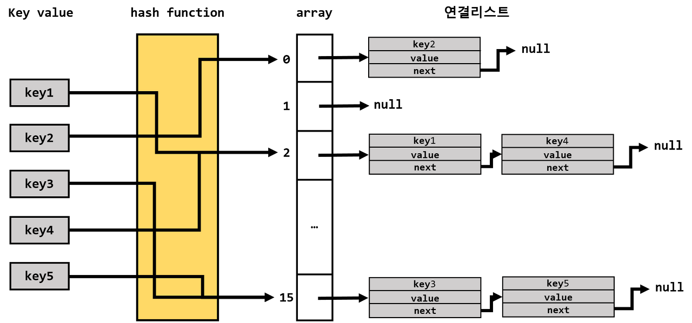

# Set\<E>

데이터의 저장 순서를 유지하지 않음. 중복 비허용. null도 한개만 저장됨.&#x20;

Set 컬렉션은 인덱스로 객체를 검색해서 가져오는 메소드가 없음

대신 전체 객체를 한번씩 반복해서 가져오는 반복자 Iterator를 제공&#x20;

*   Iterator 인터페이스에 선언된 메서드&#x20;

    * `hasNext()` - return ; 가져올 객체가 있으면 true, 없으면 false&#x20;
    * `next()` - return ; E, 하나의 객체를 가져옴&#x20;
    * `remove` - return ; void, Set 컬렉션에서 객체를 제거.&#x20;


## Set 구현 클래스&#x20;

### 1. HashSet

Set 인터페이스의 구현 클래스. 순서가 필요없는 데이터를 hash table에 저장.&#x20;

```java
Set<E> set = new hashSet<E>() ;
Set<String> set = new hashSet<String>() ;
```

* hashSet 은 객체를 저장하기 전에 객체의 `hashCode()` 메서드를 호출해서 해시코드를 얻어냄. 이미 저장된 해시코드가 있으면 중복인걸 알고 저장하지 않음.&#x20;
* 문자열을 HashSet에 저장할 경우, 문자열이 같은 String 객체는 동등한 객체로 간주함. (String 클래스가 `hashCode()`와 `eqaul()`메서드를 재정의함.) &#x20;

<details>

<summary>Hash ?? </summary>

해시 알고리즘이란 hash function을 이용하여 데이터를 해시 테이블에 저장하고 다시 그것을 검색하는 알고리즘.

해시 알고리즘을 이용한 자료구조는 아래 그림과 같이 배열과 배열로 연결 리스트로 구현됨.&#x20;

* 저장할 key값과 value를 넣으면 해시함수는 int index = key.hashCode() % capacity 연산으로 배열의 인덱스를 구하여 해당 인덱스에 저장된 연결 리스트에 데이터를 저장함.&#x20;
* idx가 이렇다 보니 순서가 뒤섞이는 것임.&#x20;
*

    <figure><figcaption></figcaption></figure>

</details>

### SortedSet (검색 기능 강화 ?)

### 2. TreeSet

이진 트리(binary tree)를 기반으로 한 Set 컬렉션. 여러개의 노드가 트리 형태로 연결된 구조. 이진 트리는 여러개의 node가 트리 형태로 연결된 구조로, root node 라고 불리는 하나의 node에서 시작해서 각 node에 최대 2개의 node를 연결할 수 있는 구조를 가지고 있음.&#x20;

### 3. LinkedHashSet
