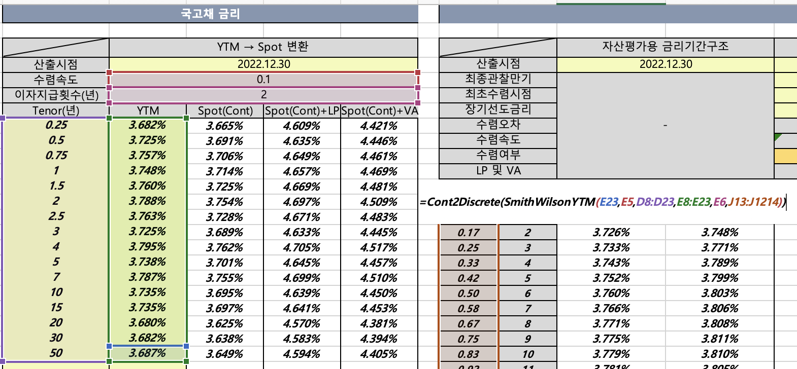

# 기본개념

<details>

<summary>Type ; 자료형 , Wrapper Class</summary>

* 변수 : @stack 영역에 생성됨.&#x20;
* 기본타입 : 값 자체를 저장함 (@stack) ; primitive&#x20;
*   참조타입 : 객체가 생성된 메모리(@heap) 주소(@stack)를 저장함. ; interface, class, array

    * String 문자열은 대표적인 참조타입 , 자체가 객체임
    *

        <figure><figcaption></figcaption></figure>


## 무슨 차이 `Double` vs. `double` ??

#### wrapper class

자바에서 기본 타입(primitive type)과 래퍼 클래스(wrapper class)가 있습니다. `double`은 기본 타입이며 `Double`은 래퍼 클래스입니다.

`Double`은 `double`의 객체 표현입니다. 따라서 `Double`은 null을 허용하며, 객체로서의 기능을 제공합니다. 이에 비해 `double`은 null을 허용하지 않으며, 객체로서의 기능을 제공하지 않습니다.

따라서 필드를 `Double`로 선언하면 해당 필드에 null 값을 할당할 수 있습니다. 이는 유용한 경우가 많습니다. 예를 들어, 데이터베이스에서 값을 가져올 때 null 값을 가져올 수 있기 때문에 `Double`을 사용하면 이를 처리할 수 있습니다. 또한, 클래스의 필드 중에 값을 초기화하지 않을 경우 null 값을 할당할 수 있습니다.

그러나 `Double`은 기본 타입인 `double`보다 더 많은 메모리를 사용하며, 성능면에서도 느릴 수 있습니다. 따라서 값이 항상 존재하고 null을 필요로 하지 않는 경우에는 `double`을 사용하는 것이 더 적절합니다.

*   엔진에서는 엔티티 필드를 정의할 때 기본타입으로 정의하지 않고 Wrapper 클래스로 정의함.  \
    \


    <figure><figcaption></figcaption></figure>

</details>

<details>

<summary>member (클래스 구성요소)</summary>

* field  : 속성을 표현함 DB로 치자면 컬럼.&#x20;
* method : 기능을 표현함.&#x20;

클래스에 고정된 정적(static) 멤버 <-> 인스턴스에 귀속된 인스턴스 멤버&#x20;

</details>

<details>

<summary>Static Member (정적 멤버)</summary>

* 클래스의 모든 인스턴스가 공유하는 멤버. 해당 클래스로 생성한 모든 인스턴스가 공유하는 멤버&#x20;
* 필드, 메서드를 공유멤버로 선언할 수 있음. **static** 키워드 사용

#### 클래스 필드&#x20;

* **정적 필드**는 클래스에 포함되어 클래스의 생명주기와 같으므로 '**클래스 필드**' 라고 함.&#x20;
* 정적 멤버는 프로그램이 시작될 때 **딱 한 번** 메모리의 **코드 영역**에 할당됨. 프로그램 종료시까지 유지.&#x20;

#### 클래스 메서드&#x20;

* 선언부에 **static** 키워드가 선언된 메서드. static으로 선언하면 무조건 main() 실행 전에 코드 메모리 영역에 생성되어 사용준비를 완료함.&#x20;
* 인스턴스 생성과 무관하게 사용되는 메서드. (프로그램 시작 시 자동으로 사용준비를 완료함. )

</details>


<details>

<summary>Instance 인스턴스 </summary>

* 인스턴스는 일반적으로 실행 중인 임의의 프로세스, 클래스의 _현재 생성된 오브젝트_를 가리킨다.
* 객체 지향 프로그래밍(OOP)에서 인스턴스(instance)는 해당 클래스의 구조로 컴퓨터 저장공간에서 할당된 실체를 의미한다. 여기서 클래스는 속성과 행위로 구성된 일종의 설계도이다. OOP에서 객체는 클래스와 인스턴스를 포함한 개념이다.
* 객체(오브젝트)의 인스턴스는 데이터베이스나 SGA, 백그라운드 프로세스등 광범위한 컴퓨터시스템 **자원의 접근에 할당된 물리 메모리의 일부**를 가리킨다.
* 테이블 인스턴스(또는 데이터베이스 인스턴스): 데이터베이스 설계의 개념. 로우 (데이터베이스) 문서 참고.
* 종종 컴퓨터나 수학 등에서 인스턴스는 사전적 의미로서 일반적인 경우에 대한 실제적인 특정 상황으로 실현된 경우이다. 즉 실질적 예이다.

<!---->

* &#x20;인스턴스 멤버 : 객체 생성 후 사용할 수 있는 메서드, 필드&#x20;
* <-> static 멤버 : 클래스에 고정된 멤버, 객체가 없이도 사용할수 있는 멤버&#x20;

</details>

<details>

<summary>자바의 메모리</summary>

JVM은 자바 프로그램을 실행하면 데이터를 메모리에 생성한 후 사용함. 메모리는 세가지 영역으로 구분됨.&#x20;

1. **Code 영역 ; 메서드 영역**&#x20;
   * 자바 소스파일(test.java)이 컴파일 되면 test.class이 되는데, .class파일을 실행하면 JVM의 클래스 로더가 test.class 파일을 실행하기 위해 필요한 클래스파일을 메모리에 올림.&#x20;
   * 메모리에 올린다 = 자바소스파일에 정의한 클래스에 관한 정보와 코드를 코드영역에 만드는 것.&#x20;
   * 클래스별 상수, static 필드, 메서드 코드, 생성자 코드&#x20;
2. **Heap 영역**&#x20;
   * 객체가 생성되는 영역 &#x20;
   * new 명령문으로 인스턴스를 생성하면 메모리의 힙 영역에 생성됨.&#x20;
   * 실제 이 클래스의 메서드코드는 코드영역에 만들어지고, 힙 메모리에는 필드만 생성됨. &#x20;
   * **필드** -> 클래스의 속성을 나타내는 변수, 클래스의 구성요소, 메모리에 생성된 후 자동으로 초기화됨.  ( new 명령문에 의해 객체가 생성되면서 **힙**에 생성됨 )
3. **Stack 영역** &#x20;
   * &#x20;**지역변수** -> 메서드가 실행되면서 필요한 데이터를 잠시 유지하기 위해 사용되는 변수, 메서드 내에 선언한 변수, 자동으로 초기화되지 않으므로 선언과 초기화를 해줘야 함. (메서드가 호출되어 실행될 때 스택에 생성됨. 메서드 실행이 종료되면 스택에서 자동으로 삭제됨. )

**new 명령문은 클래스에서 정의한 필드를 힙메모리에 생성**함. 자바프로그램은 힙 메모리에 직접 접근할 수 없음. 직접 접근 가능한 메모리는 스택 뿐임.&#x20;

* 스택 메모리에 참조변수(ytm)를 선언하고 이 변수에 **힙 메모리에 생성**된 인스턴스의 참조 정보를 저장해서 접근하는 방식을 용함.&#x20;
* 즉, new 명령문이 인스턴스를 힙 메모리에 할당할 때 반환하는 참조 정보를 변수에 저장해 사용함으로써 인스턴스에 접근할 수 있음. 결국 참조변수에는 할당된 메모리의 위치 정보가 저장됨.&#x20;
* 일반 필드는 인스턴스에 포함되어 각 인스턴스의 생명주기와 같으므로 인스턴스 필드라고 함.&#x20;


```java
public static List<IrCurveYtm> 
    createYtmFromUsrHis(String bssd, String irCurveNm) {
    //클래스명 참조변수명 = new 클래스명();
    IrCurveYtm ytm = new IrCurveYtm(); // 참조변수의 선언 
    }
    
/* ytm : 지역변수, 메서드 createYtmFromUsrHis()내에 선언, 메서드 실행 시 스택 메모리에 생성.
         데이터 타입은 참조하려는 대상과 같으므로 IrCurveYtm로 지정함. 
         IrCurveYtm 인스턴스의 메모리 위치 정보를 가지는 참조변수. */
/* new IrCurveYtm() : 힙 메모리에 IrCurveYtm 인스턴스를 생성하는 명령문
                    , 할당된 메모리의 위치정보, 즉 참조정보를 반환함 */ 
/* = : 반환한 참조정보를 ytm에 대입함. */ 
```


</details>

내부 클래스 (중첩 클래스)

익명 클래스&#x20;


<details>

<summary>framework vs. API ?</summary>

#### framework

프레임워크는 프로젝트 개발에 도움이되는 클래스, 도구 및 관련 구성 요소 집합.

프레임워크는 완성된 제품이 아닌 완성된 제품을 만들기 위해 개발자를 도와주는 또는 기반이 되는 역할을 한다. 즉, 소프트웨어의 특정 문제를 해결하기 위해 상호 협력하는 클래스와 인터페이스의 집합.

프레임워크는 애플리케이션 프로그래밍 인터페이스(API)와 유사합니다. 기술적인 측면에서 프레임워크에는 API가 포함되어 있습니다. 프레임워크는 프로그래밍의 기반인 반면, API는 프레임워크가 지원하는 요소에 대한 액세스 권한을 제공합니다.

#### API

Java API는 기능을 캡슐화하는 구성 요소 집합에 대한 인터페이스.

API는 Application Programming **Interface**. Java의 API는 각각의 메소드, 필드 및 생성자가 있는 미리 작성된 패키지, 클래스 및 인터페이스의 모음입니다. 때로는 프로그래머가 내부 구현에 대한 관심없이 특정 기술을 사용해야하는 경우가 있습니다. API는 이러한 상황에서 유용합니다. 개발자는 API에서 미리 정의 된 작업을 사용하여 응용 프로그램을보다 쉽게 ​​만들 수 있습니다. Java에는 4500 개 이상의 API가 있습니다

Java API는 소프트웨어를 작성하기위한 서브 루틴 정의, 통신 프로토콜 및 도구 세트입니다. Java Framework는 일반적인 기능을 제공하는 소프트웨어를 추가 사용자 작성 코드로 선택적으로 변경하여 응용 프로그램 별 소프트웨어를 제공하는 추상화입니다.

</details>

<details>

<summary>Lombok</summary>

설치  [https://projectlombok.org](https://projectlombok.org/)

참고 출처  [https://mangkyu.tistory.com/78](https://mangkyu.tistory.com/78)

이걸 왜 쓰느냐  :&#x20;

* java에서 Data를 정의해서 사용할때 VO class 를 만들면 꼭 해야하는 일들이 생김 (Getter, Setter, 생성자 만들기, ToString 등등 -> 이클립스 등에서 코드를 자동으로 짜줄만큼 빈번하게 반복되어온 일.)&#x20;
* class내에 variable을 직접 호출하지 않고 필요 시 Getter를 이용해서 불러다 씀. 캡슐화라고 함.(구체적인 구현방식은 남이 신경 안써도 된다는 취지) &#x20;

<!---->

* 그럼 다시 lombok이 뭐냐면 :&#x20;
  * annotation 기반(@로 시작하는 주석같은거)으로 코드를 자동완성해주는 라이브러리. 즉 @Getter, @Setter 이런식으로만 쓰면 위의 귀찮은 작업을 자동으로 다 해줌.
  * 게다가 log4j2 처럼 로그 클래스를 자동 완성시켜준다 ?? -> 대충 로그를 찍기 쉽게 해준다는 뜻으로 이해함.&#x20;
  * 참고로 @Data 이거 쓰면 거의 모든게 그냥 다 되는데 그렇기 때문에 좀 무겁다고 함. (비추)&#x20;


</details>


#### **객체를 선언할 때는 클래스가 아닌 인터페이스로 선언한다 (**[Broken link](broken-reference "mention"))

변수를 선언할 때 고유한 특성을 갖는 구현체가 아닌 인터페이스로 선언하면 해당 변수를 단일한 구현 객체의 형태로 제한되지 않아서 같은 인터페이스를 바탕으로 구현한 모든 객체가 호환되어 코드의 유연성이 높아진다&#x20;


